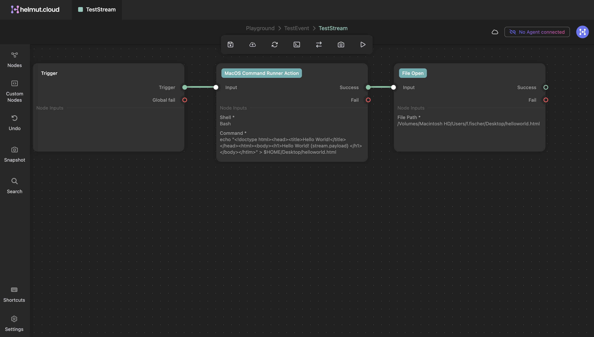
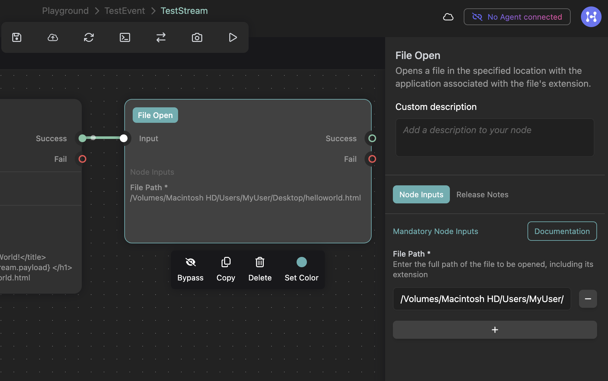

# Step 3: Create a workflow

### Make some space in High5

A space is a good starting point for your workflow. It will allow to manage all the important details about it while maintaining order.

* Go to High5 - Spaces and click on "_Create Space_"
* Give it a name that makes sense to you (like '_Playground_') and click "C_reate_"

Now your space is listed in High5 and can be entered.

### Already hooked? Let's do webhooks!

Every workflow needs a starting point. In helmut.cloud, _events_ are used to induce workflows and trigger the programs that we call streams. So every event has one or more streams assigned that executes whatever logic you built it to do.

If you want an outside source to trigger your workflow, like a cloud service with webhook support or your own server, you could use a webhook with your event.

Let's make a webhook and trigger it with a `curl` command from terminal to execute the stream we are going to build later. Create an event and name it "_TestEvent_", for example. You will see that your event is empty, meaning: It does not contain a stream yet.

We create a webhook anyway. Click on the webhook-icon next to the events name, and configure a webhook that we could name "_TestEventWebhook_". It triggers our event "_TestEvent_", and your personal account will be the target, so fill in your accounts e-mail address.

If you do not want unauthorized parties to execute your webhook, secure it with additional headers or an HMAC signature and a preshared key. Both can be added below "_Advanced options_".

To make it easy in this tutorial, we will only use a header with an unencrypted password. My header key will be "_knockknock_" and the value will be "_itsme_". Click "_Create_" and your webhook is ready. As we can copy the link again later, I will just close the window to proceed with my stream.

### Automate your workflow: create a stream

Go back to the events from your Playground-space and find your _TestEvent_. To eventually build the workflow logic and automate something, let's add a stream with "_+ Add stream_".

Our "_TestStream_" can be created and then entered by clicking on it. The StreamDesignerStudio will open, allowing you to define a workflow built in a graphical user interface.

In this stream, we will build a simple logic: Whenever the webhook is being triggered, a website opens in our workstations webbrowser. The result will look like this:

<figure><figcaption>
Our goal: StreamDesignerStudio with the finished test-stream with three nodes to write and open a file in a browser
</figcaption></figure>

Your canvas will be empty on first opening, only showing the mandatory "Trigger" node. This node is the starting point in every stream.

In the sidebar menu on the left, you will find some categories to search for nodes that you could use. Let's start with a node that performs a predefined action. As I am on a Mac and I am looking for a way to write a file while having some fun, I choose the **MacOS Command Runner** Action Node. This one basically executes a bash-command on your workstation.&#x20;

Using Windows? We've got you captured. There is a CMD version of this, too.

Drag in on the canvas and click on it. Another sidebar opens up at the right side, offering more inputs for your action.&#x20;

<figure><figcaption>
Writing an HTML file with the MacOS Command Runner Action
</figcaption></figure>

Choose your favorite shell and echo some HTML code into a file somewhere accessible to you.

<pre class="language-bash"><code class="lang-bash"><strong>#!/bin/bash \
</strong><strong>echo "&#x3C;!doctype html> \
</strong>&#x3C;head> &#x3C;title> Hello World from HCloud! &#x3C;/title> &#x3C;/head> \
&#x3C;html> &#x3C;body> &#x3C;h1> Hello World! &#x3C;/h1> &#x3C;/body> &#x3C;/html>" \
> $HOME/Desktop/helloworld.html
</code></pre>

That is a nice HTML file. We want some logic to open this in our browser. To achieve this, we could use the shell again, or even simpler: a predefined action called **FileOpen**. FileOpen will use whatever standard software is defined in your OS to open the given filetype.

<figure><figcaption>
A full filepath to our html-file in the FileOpen node will make this a lot easier for now.
</figcaption></figure>

Specify your HTLM-files path and connect all "Success" to "Input" connectors of the nodes, starting from left to right in the order of their execution.

Now save and press publish in the upper menu bar with the cloud-and-arrow icon. From now on, your stream is available for execution.

We are as far as we can get here. Before we can execute this stream and test it, we need to [install and configure the HCloud agent](step-4-install-the-helmut.cloud-agent.md) on your system. You can leave Stream Designer Studio as it is and come back later.
