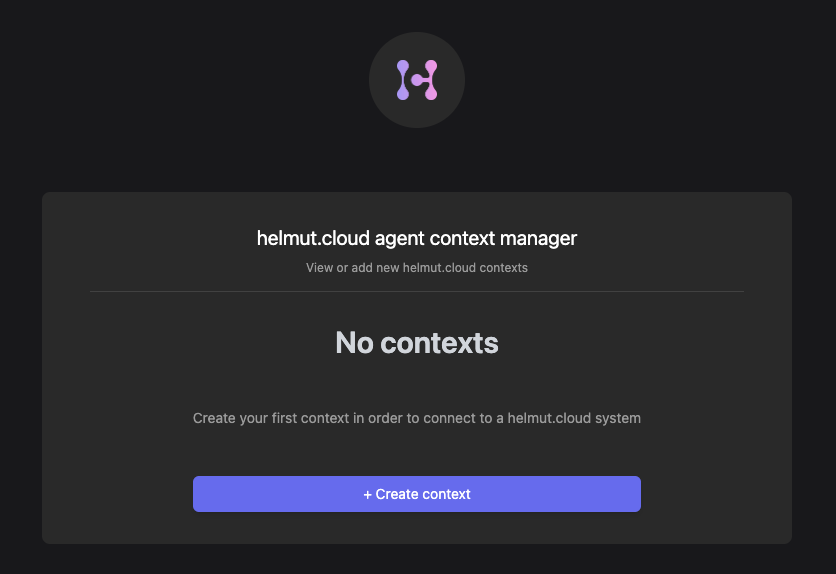

# Step 4: Install the agent

This is no cold war thriller - the helmut.cloud agent is the piece of software that will execute your workflows for you.&#x20;

Click on your avatar icon in the upper right corner and select "Download agent". Choose an installer that will work with your operating system.&#x20;

Now configure the agent and add a context. The easiest way is to use your own account for testing. Make sure that you [enabled your account as a target](../organizations/view-my-organizations/being-a-target.md) for the organization used.

Right-click the H-icon and choose "Configure". A website opens in your browser. By default, no context is defined. To add context, click on "Create context" and log in with your account.

<figure><figcaption>
Bring your agent into the right context by logging
</figcaption></figure>

You are now ready to run your first workflow on your workstation.

[All the details about installing and configuring the agent can be found here.](../the-hcloud-agent/install-the-hcloud-agent-software/)

