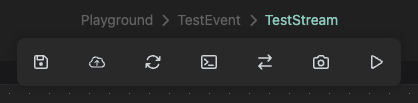
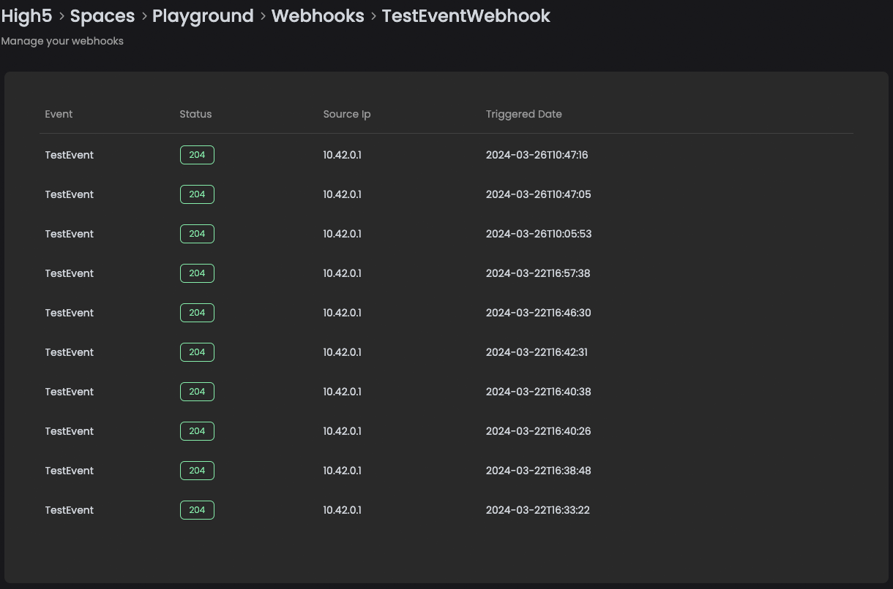
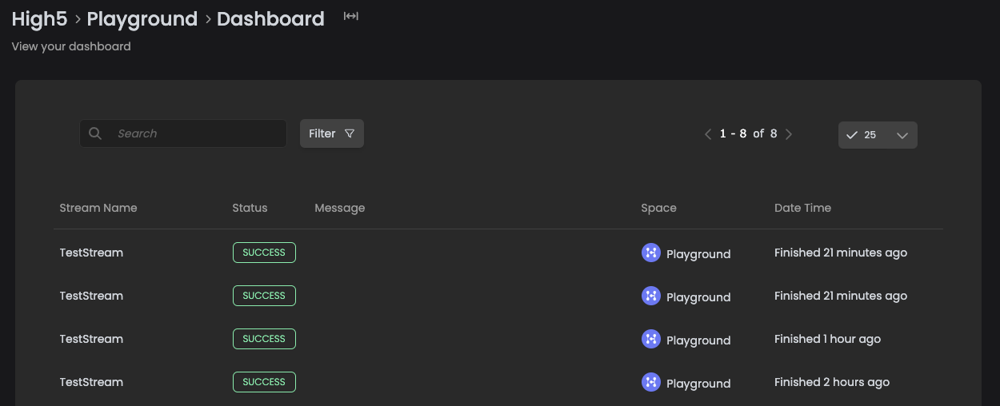

# Step 5: Run your first workflow

## Back to Stream Designer Studio

Now that your agent is installed and configured, it can be used to execute streams. Change back into the Stream Designer Studio and have a look to the upper right corner. Next to the little cloud symbol, is a tag that informs you if your agent is connected or not. Because we did that just a few moments ago, chances are that it is disconnected.

<figure><figcaption><p>The HCloud agent connection button in SDS lets you connect an agent with matching context</p></figcaption></figure>

Click on the symbol and choose your agent from the list below. Click "_Connect_". The connection will be established.

To test your stream before you use the webhook, you can first save, then publish and finally test it with the buttons in the stream control tool bar on the middle upper edge of the canvas. There is a payload stated when testing. Right now, we do not use it, so you can simply ignore it.

<figure><figcaption><p>The stream control toolbar: save - publish - reload - debugger - exchange - snapshot - test</p></figcaption></figure>

If something goes wrong, you can check the debuggers log for errors to resolve the problem.


## Aaaand - action!

The moment has come, tension rises: You can now use the webhook and trigger it with `CURL` from a terminal.

* Open a terminal (and check if you have `CURL` installed)
* Copy the webhooks URL from the your spaces webhooks-section by clicking the little pasteboard icon next to the name
* Enter this prompt into your terminal and replace the placeholder with your webhook-URL:

```bash
curl "https://app.helmut.cloud/api/high5/v1/org/MyOrganization/placeholder" \
-H "knockknock:itsme" -H "content-type:application/json" -d "{}"
```

If your hello-world website opens in your browser now: Congratulations, you made it!  🥳


## Troubleshooting and logs

You can later observe if your webhook accepted the trigger by clicking on the name in the webhooks-section and view the logs. If you get a `204`, this is fine, because we did not send any content in the payload of the call. Click on the entry to view some details about the call, like headers and payload or response.

<figure><figcaption><p>Make a click your webhook to view the details of the call, like header, body and return</p></figcaption></figure>

Your dashboard tells you wether your stream succeeded or failed. You can successfully trigger a webhook, but have a failing stream when something went sideways.

<figure><figcaption><p>A look into your spaces dashboard gives you an wider overview of all streams executed</p></figcaption></figure>
