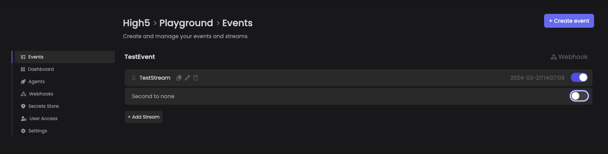

# Events

An event is a starting point for one or multiple streams. All streams that are to be found underneath one event will execute in the order of their listing (starting at the top), once the event has been triggered (e.g. by an [event webhook](webhooks.md)).

The switches next to the streams enable or disable the single stream. In a modularly built stream execution, you could disable certain parts of your workflows by simply disabling the stream which provides the function(s) you want to stop executing. This also helps in debugging complex workflows.

<figure><figcaption>
An enabled and a disabled stream inside the event called "TestEvent". The Webhook-button in the upper right provides direct access to the events webhook, or lets you create one.
</figcaption></figure>

* To add a stream to an event, use the "_+ Add Stream_" button in the lower left corner of the list
* To edit a stream, use the pencil icon and enter StreamDesignerStudio
* To duplicate a stream, use the paper-sheets icon
* To delete the stream, use the trash-bin icon
