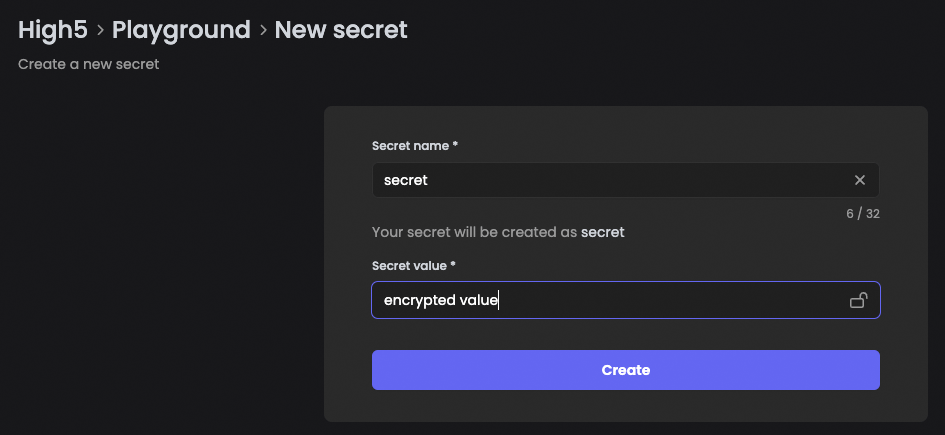

# Secrets Store

The Secrets Store enables users to store value. A user can choose if a value needs to be concealed or not.

A secret remains unrevealed during stream execution. To read and use a secret in a stream, the node "_Get Secret_" should be used.

## Create a secret

Go to the Space where your secret will be needed. Navigate to the "_Secrets Store"_ in the menu on the left side. A list of all secrets available in this Space appears.

* Click on the button "_+ Create secret_" in the upper right quarter of the UI
* Assign a unique name to your secret
* Fill in a value
* Click on the padlock-icon to close it and conceal the value, if needed
* Click on "_Create_" to finish the process and create the secret

The secret is now visible in the list, and when chosen, the value is concealed by asterisks.

<figure><figcaption>
Use the padlock icon to conceal the value in lists and logs
</figcaption></figure>
