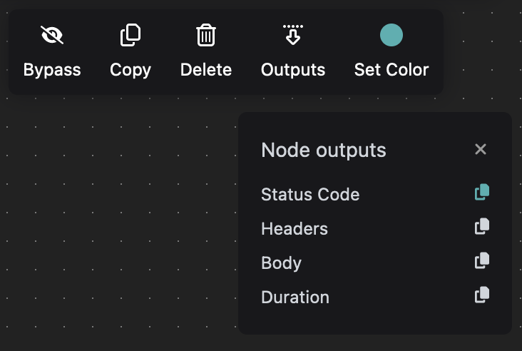

# Node inputs and outputs

To input a payload that is being delivered to the stream (for example from a webhook), use the wildcard `{{payload.data}}` in a nodes input field. It will be resolved with the payload sent to the event /stream.

To read a nodes result, you will need its ID and you need to know the nodes outputs. They are to be found underneath the node with the little "&#x4F;_&#x75;tputs_" dropdown-menu, or visible in the debugger when testing.&#x20;

<figure><figcaption><p>The http clients outputs underneath the nodes toolbar as a dropdown menu</p></figcaption></figure>

They will be accessible by wildcard:

```
{{output.nodeid.NameOfOutput}}
```

Or more practical: If you wanted to read stderr output from the MacOS Command Runner action, you would resolve the value with a wildcard as follows:

```
{{output.64d3482f-3151-4615-ah29-1a8d2d1cf84b.StdOut}}
```
