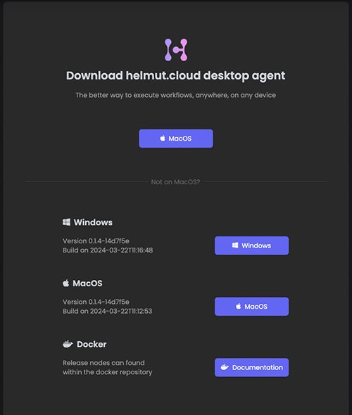

# Install the helmut.cloud Agent software

Click on your avatar icon in the upper right corner and select "_Download Agent_". Choose an installer that will work with your operating system. Curious about the Docker client? [Read on here](docker.md).

After installation, the agent will be running inside your taskbar, identifiable by the helmut.cloud Agent icon. The Agent is running headless, configurable with a little menu that opens on right-click.

<figure><figcaption>
The download-section offers the most recent version for your current OS.  Builds for other OSes are accessible as well.
</figcaption></figure>
